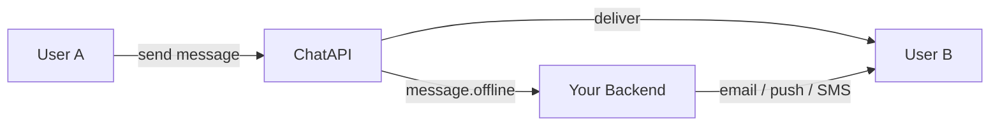
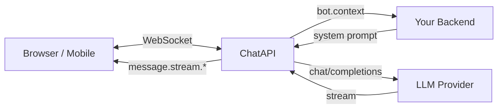

+++
title = "ChatAPI Documentation"
type = "book"
weight = 1
+++

  

Real-time chat infrastructure for AI-powered apps.

  
  
  
  

  <a href="/getting-started/">Quick Start</a> ·
  <a href="/api/rest/">API Reference</a> ·
  <a href="/guides/bots/">AI Bots</a> ·
  <a href="https://github.com/getchatapi/chatapi">GitHub</a>

---

ChatAPI is a self-hosted messaging server for apps where AI participates in conversations. It handles real-time delivery, message history, presence, typing indicators, and LLM streaming — so you focus on your product, not the plumbing.

## How it fits in your stack

### Messaging

Users connect over WebSocket. ChatAPI stores messages, broadcasts to online room members, and fires a webhook when a recipient is offline — your backend decides how to notify them.

### AI Bots

When a bot is in a room, ChatAPI calls your backend webhook to get the system prompt — your RAG pipeline, customer data, and escalation logic stay in your app. ChatAPI calls the LLM and streams tokens back to clients in real time.

## Built for

| Use case | How ChatAPI fits |
|---|---|
| **In-app messaging** | Add DM and group chat to any product — presence, typing indicators, and message history included |
| **Push notification relay** | Webhook fires when a message arrives for an offline user — forward to FCM, APNs, email, SMS, or any channel |
| **Customer support** | Bot handles tier-1 questions; human agent takes over with `skip: true` escalation |
| **In-app AI assistant** | Add an AI chat panel to any SaaS product — bot answers questions about your data via RAG in the webhook |
| **Sales & lead qualification** | Bot qualifies leads 24/7; human rep steps in when the lead is warm |
| **User onboarding** | Bot guides new users through setup; escalates to a human success manager for complex accounts |
| **Internal team AI** | Add AI bots to team rooms to answer questions about docs, policies, and internal data |

## Features

- **Managed AI bots** — register a bot with an LLM provider URL; ChatAPI calls the model, streams tokens back via `message.stream.*` events, and stores the reply
- **Real-time messaging** — rooms (DM or group) with presence, typing indicators, and at-least-once delivery
- **JWT auth** — your backend signs tokens, ChatAPI validates them; no vendor accounts, no sessions
- **Offline delivery** — messages queue for offline users; webhook fires so you can send push notifications
- **Escalation support** — webhook can return `{"skip": true}` to silence a bot when a human agent takes over
- **Single binary** — SQLite included, no external services required
- **Portable** — swap SQLite → PostgreSQL or local pub/sub → Redis by implementing one interface

## Documentation

- [Getting Started](/getting-started/) — Installation, configuration, and first API call
- [REST API](/api/rest/) — HTTP endpoint reference
- [WebSocket API](/api/websocket/) — Real-time event reference
- [AI Bots](/guides/bots/) — Register a bot and connect it to a room
- [Architecture](/architecture/) — System design and internals
